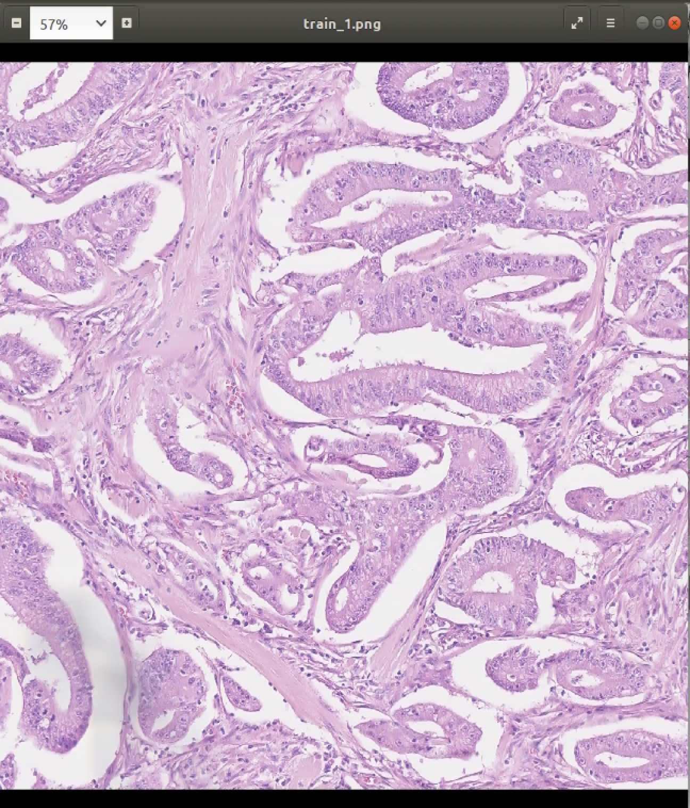
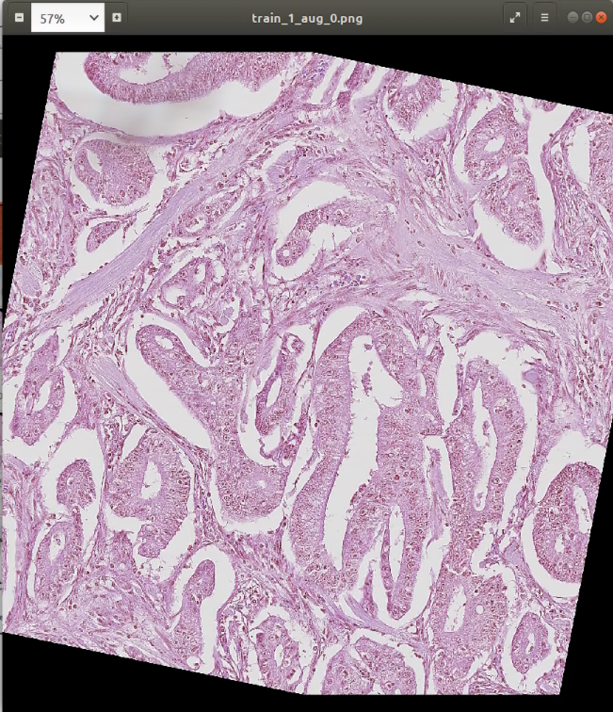
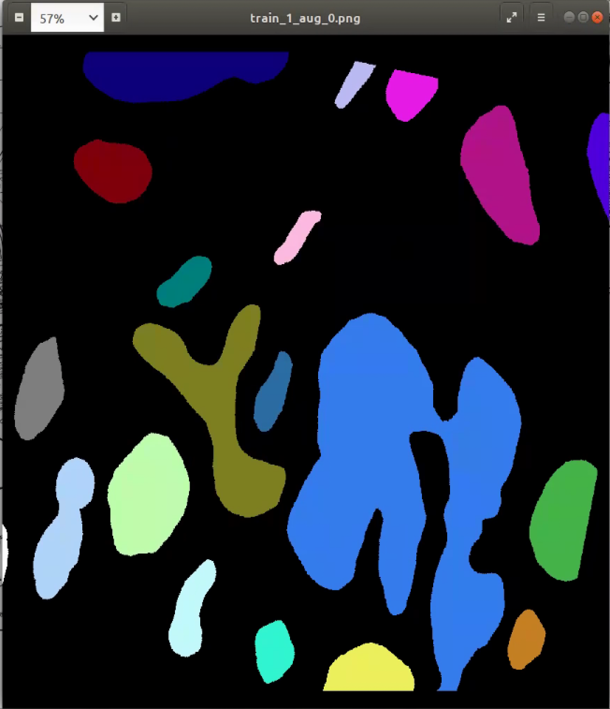

# Colorectal Adenocarcinoma Gland (CRAG) Dataset (v2)

Description: 
This dataset contains 213 H&E colorectal adenocarcinoma image tiles at 20x magnification with full instance-level annotation. This data was used as a dataset within the MILD-Net paper, published at Medical Image Analysis. The data is split into train and test sets, which contain 173 and 40 images respectively. If you intend to publish research work that uses this dataset, you must give appropriate citation to the MILD-Net paper. Version 2 removed the 5 extra images that were in test/Annotation/.

Data Structure:

- train /Images/
        /Annotations/
 	/Overlay/

- test	/Images/
        /Annotations/
        /Overlay/

Images: Original H&E image tiles at 20x magnification. For a full description please refer to the paper.

Annotations: Instance-level ground truth

Overlay: Gland annotations overlaid on top of the original image.

# Dataset acquisition address
https://warwick.ac.uk/fac/cross_fac/tia/data/mildnet/

# CRAG-Dataset Rank in paperwithcode
https://paperswithcode.com/sota/colorectal-gland-segmentation-on-crag

# The following is my specific operation：

## (1)Download the data enhancement library on github at:
https://github.com/aleju/imgaug

## (2)Read the official documentation to decide how to augment:
https://imgaug.readthedocs.io/en/latest/

Choose according to python version:

pip install git+https://github.com/aleju/imgaug.git
pip install imagecorruptions

## (3)Execute the corresponding python file, (Note: you need to change the corresponding data set path)

Randomly enhance the original image and annotations, this code including:Crop,Sharpen,Multiply,GaussianBlur,Affine

## (4)Next, convert the marked png to json format:

https://github.com/waspinator/pycococreator/blob/master/README.md
https://patrickwasp.com/create-your-own-coco-style-dataset/
